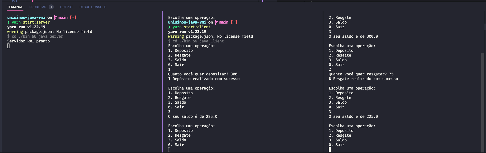

# 🧱 unisinos-java-rmi
Crafting a distributed bank account simulation system using Java RMI (Remote Method Invocation) offers a compelling exploration into distributed computing. With this project, we delve into the world of finance and technology, simulating bank account operations across distributed nodes. Through Java RMI, we enable seamless communication between these nodes, demonstrating the power and versatility of remote method invocation in building robust, distributed systems.

## :computer: Preview


## :fire: Used technologies
- Java
- Java RMI

## :wrench: Compiling Running locally

To compile and run this project with the commands listed below you must have the `JDK` and `npm` or `yarn` installed in your machine. If you just have the `JDK` installed you can copy the commands inside `package.json`. 

Compile the Java files by running 
```
yarn compile
or
npm run compile
```

Start the server process by running
```
yarn start:server
or
npm run start:server
```

Start how many clients you want by running in different terminals
```
yarn start:client
or
npm run start:client
```

## :man: Contributors
- [@emiliosheinz](https://github.com/emiliosheinz)

